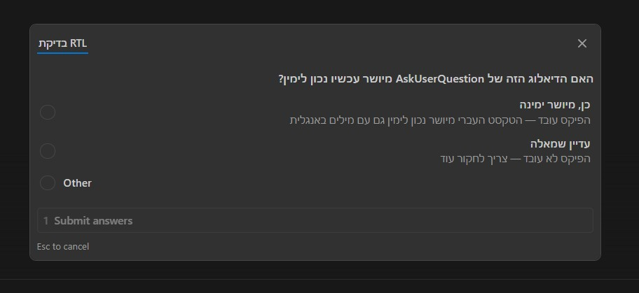
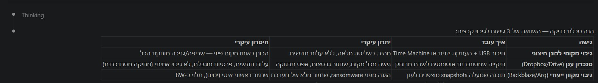

<div dir="rtl">

# תיקון עברית (RTL) ל-Claude Code ב-VSCode
https://github.com/user-attachments/assets/fd6d088b-678a-4300-8764-be10fba1bc6f

בלי התיקון הזה, עברית מוצגת הפוך בתוסף Claude Code — <code>םולש</code> במקום <code>שלום</code>.

## הבעיה

ה-CSS של Claude Code כולל שני כללים שהורסים עברית:

1. <code dir="ltr">unicode-bidi: bidi-override</code> — הופך את סדר התווים. ״שלום״ הופך ל-״םולש״
2. <code dir="ltr">* { direction: ltr }</code> — כופה כיוון שמאל-לימין על **כל** אלמנט בעמוד, כולל צאצאים בתוך בועות הודעה

התוצאה: עברית לא קריאה, פסקאות מיושרות לשמאל, פיסוק ומספרים במקום הלא נכון.

## מה הסקריפט עושה — הכל, מהתחלה עד הסוף

### שלב 1: תיקון תווים הפוכים

מחפש את הכלל <code dir="ltr">bidi-override</code> בקובץ ה-CSS של התוסף ומחליף אותו ב-<code dir="ltr">normal</code>. זה לבד מספיק כדי שמילים בעברית יהיו קריאות (מצב **word**).

### שלב 2: הזרקת CSS

מוסיף בלוק CSS לסוף הקובץ שעושה את הדברים הבאים:

<table>
<tr><th>מה</th><th>על מה</th><th>למה</th></tr>
<tr>
<td><code dir="ltr">unicode-bidi: isolate</code></td>
<td>פסקאות, כותרות, פריטי רשימה, תאי טבלה, ציטוטים</td>
<td>מבודד כל אלמנט כיוונית — כל פסקה יכולה להיות RTL או LTR בלי להשפיע על השכנות שלה</td>
</tr>
<tr>
<td><code dir="ltr">text-align: start</code></td>
<td>כל האלמנטים הנ״ל</td>
<td>היישור עוקב אחרי הכיוון — עברית מיושרת ימינה, אנגלית שמאלה</td>
</tr>
<tr>
<td><code dir="ltr">direction: ltr</code> + <code dir="ltr">unicode-bidi: embed</code></td>
<td>בלוקי קוד (<code>pre</code>, <code>code</code>)</td>
<td>קוד תמיד נשאר שמאל-לימין, גם בתוך פסקה עברית, מבודד מהקונטקסט</td>
</tr>
<tr>
<td><code dir="ltr">list-style-position: inside</code></td>
<td>פריטי רשימה שזוהו כ-RTL</td>
<td>הנקודה/מספר של הרשימה מופיעים בצד ימין, לא שמאל</td>
</tr>
<tr>
<td><code dir="ltr">unicode-bidi: plaintext</code></td>
<td>חלונית הפרומפט (שדה הקלט)</td>
<td>מזהה אוטומטית את כיוון הטקסט תוך כדי הקלדה — מתחילים לכתוב עברית? הכיוון מתהפך</td>
</tr>
<tr>
<td><code dir="ltr">unicode-bidi: isolate</code></td>
<td>בועות הודעה שנשלחו (<code dir="ltr">userMessage</code>)</td>
<td>בידוד כיווני של ההודעה כולה</td>
</tr>
<tr>
<td><code dir="ltr">direction: inherit</code></td>
<td><strong>כל</strong> הצאצאים בתוך בועת הודעה (חוץ מקוד)</td>
<td>מנטרל את הכלל הגלובלי <code dir="ltr">* { direction: ltr }</code> — הצאצאים יורשים כיוון מההורה במקום לקבל LTR בכוח</td>
</tr>
</table>

### שלב 3: הזרקת JavaScript

מוסיף סקריפט JS לסוף <code dir="ltr">index.js</code> שעושה ארבעה דברים:

**א. זיהוי כיוון per פסקה בתגובות קלוד**

כל פסקה, כותרת, פריט רשימה, תא טבלה וכו׳ נבדקים בנפרד. הזיהוי:

- סורק את הטקסט (מתעלם מתוכן בלוקי קוד)
- מוצא את **האות החזקה הראשונה** (מדלג על אמוג׳ים, מספרים, פיסוק, רווחים)
- סופר אותיות עבריות מול אנגליות
- מחליט:
  - אות ראשונה עברית ← **RTL** (תמיד)
  - אות ראשונה אנגלית אבל 30% או יותר מהאותיות עבריות ← **RTL**
  - אות ראשונה אנגלית ופחות מ-30% עברית ← **LTR**
  - אין אותיות בכלל ← ללא שינוי
- מגדיר <code dir="ltr">direction</code> ו-<code dir="ltr">text-align</code> בהתאם
- אם RTL — מזריק תו **RLM** &#x200F;(U+200F) בתחילת האלמנט, כדי לעגן את כיוון ה-BiDi כשהילד הראשון מכיל טקסט אנגלי (למשל שם פונקציה ב-<code>code</code> בתוך משפט עברי)

**ב. זיהוי כיוון בהודעות שנשלחו**

כל בועת הודעה שנשלחה (<code dir="ltr">userMessage</code>) עוברת את אותו אלגוריתם זיהוי ומקבלת כיוון RTL או LTR.

**ג. שומר (Watchdog) על הודעות**

VSCode עלול לאפס את ה-style של בועות ההודעה חזרה ל-LTR. השומר הוא MutationObserver שעוקב אחרי שינויי <code dir="ltr">style</code> ו-<code dir="ltr">dir</code> על כל בועת הודעה, ומחזיר את הכיוון הנכון מיד אם מישהו שינה אותו.

**ד. צפייה בתוכן חדש**

MutationObserver נוסף על <code dir="ltr">#root</code> עוקב אחרי:

- **אלמנטים חדשים** שנוספים ל-DOM (תגובה חדשה של קלוד, הודעה חדשה שנשלחה) — מפעיל עליהם זיהוי כיוון
- **שינויי טקסט** בזמן streaming של תגובת קלוד — מעדכן את כיוון הפסקה בזמן אמת תוך כדי שקלוד כותב

**ה. יישור היסטוריית שיחות ב-Sidebar**

כל שורה ב-Sidebar (רשימת השיחות) עוברת זיהוי שפה — שיחה שמתחילה בעברית מיושרת לימין, שיחה באנגלית לשמאל. אותו הדבר חל על כותרת השיחה הנוכחית בכפתור ה-header. MutationObserver מעדכן את היישור כשה-Sidebar נפתח או שרשימת השיחות משתנה.

### מנגנון הפעלה אוטומטי

הסקריפט רשום כ-**SessionStart hook** בקובץ <code dir="ltr">~/.claude/settings.json</code>. כל פעם שנפתח סשן חדש של Claude Code:

1. הסקריפט רץ אוטומטית
2. סורק את **כל** גרסאות התוסף המותקנות (<code dir="ltr">~/.vscode/extensions/anthropic.claude-code-*/webview/</code>)
3. לכל גרסה — מסיר פאטץ׳ ישן (אם קיים) ומחיל את החדש
4. אם אין מה לתקן — לא עושה כלום

זה אומר שגם אחרי עדכון של התוסף — הסקריפט מתקן אוטומטית בסשן הבא.

### שלב 4: תיקון Plan View (תוכנית עבודה)

כשקלוד יוצר תוכנית עבודה (Plan), היא נפתחת ב**טאב נפרד** — webview עצמאי לגמרי שלא משתמש בקבצי ה-CSS וה-JS של הצ׳אט הראשי. בלי טיפול ייעודי, כל העברית בטאב הזה מיושרת לשמאל.

הסקריפט מפעיל קובץ עזר (<code dir="ltr">patch-plan-rtl.js</code>) שמוצא את ה-HTML template של Plan view בתוך <code dir="ltr">extension.js</code>, ומזריק לתוכו CSS ו-JS זהים לשלבים 2 ו-3 — כולל זיהוי שפה per פסקה ו-MutationObserver.

### שלב 5: תיקון חלוניות דיאלוג (שאלות ואפשרויות)

כשקלוד שואל שאלה עם אפשרויות לבחירה, נפתחת חלונית דיאלוג. גם היא מוצגת LTR כברירת מחדל — מה שהופך טקסט עברי מעורב עם אנגלית לבלתי קריא.

הפאטץ׳ מוסיף סלקטורים ל-CSS ול-JS שמכסים את אלמנטי הדיאלוג:

<table>
<tr><th>סלקטור</th><th>מה הוא מכסה</th></tr>
<tr><td><code dir="ltr">questionText_</code></td><td>טקסט השאלה</td></tr>
<tr><td><code dir="ltr">questionTextLarge_</code></td><td>טקסט שאלה גדול</td></tr>
<tr><td><code dir="ltr">optionLabel_</code></td><td>שם האפשרות</td></tr>
<tr><td><code dir="ltr">optionDescription_</code></td><td>תיאור האפשרות</td></tr>
</table>



### שלב 6: תיקון טבלאות

<p dir="rtl">&#x200F;טבלאות Markdown ברירת המחדל נשארות LTR גם כשהתוכן כולו עברי — העמודה הראשונה תמיד בשמאל, והקריאה הולכת משמאל לימין. הסיבה: <code dir="ltr">unicode-bidi: isolate</code> על תאים (שלב 2) מטפל רק בטקסט <em>בתוך</em> תא, לא בסדר העמודות. סדר העמודות תלוי ב-<code dir="ltr">direction</code> של ה-<code dir="ltr">&lt;table&gt;</code> עצמו.</p>

<p dir="rtl">&#x200F;הפאטץ' מוסיף handler ייעודי לכל טבלה:</p>

<ul dir="rtl">
<li>מצבר את הטקסט של כל התאים (<code dir="ltr">th</code> + <code dir="ltr">td</code>) ומריץ את אותו אלגוריתם זיהוי (first-strong + סף 30%)</li>
<li>אם רוב עברית ← מגדיר <code dir="ltr">direction: rtl</code> על ה-<code dir="ltr">&lt;table&gt;</code> — סדר העמודות מתהפך, העמודה הראשונה עוברת לימין</li>
<li>בנוסף, מיישר את הטבלה עצמה לימין (<code dir="ltr">margin-left: auto; margin-right: 0</code>) — כי טבלה ברוחב טבעי מתיישרת כברירת מחדל לשמאל ונראית תלושה מהקשר העברי</li>
<li>טבלה באנגלית נשארת LTR ומיושרת לשמאל</li>
<li>ה-MutationObserver מזהה טבלאות חדשות שנוצרות תוך כדי streaming של תגובת קלוד, ומעדכן את הכיוון בזמן אמת תוך כדי שהתאים מתמלאים</li>
</ul>



### דוגמאות לזיהוי

<div dir="ltr">

```
"שלום עולם"                        → RTL (first strong = Hebrew)
"Hello world"                      → LTR (first strong = Latin, 0% Hebrew)
"Hello שלום"                       → RTL (first strong = Latin, but 36% ≥ 30%)
"1.1 Migration: הוספת שדות"         → RTL (first strong = Latin, but ~50% ≥ 30%)
"🎉 שלום"                          → RTL (emoji skipped, first strong = Hebrew)
"Error 404"                        → LTR (first strong = Latin, 0% Hebrew)
```

</div>

## התקנה

### התקנה מהירה (הדבקה לתוך Claude Code)

העתיקו את הבלוק הבא והדביקו אותו לתוך Claude Code — הוא יעשה את השאר:

<div dir="ltr">

```
Install the Hebrew RTL fix for Claude Code VSCode extension.
Do all these steps:

Step 1 — Create a scripts directory in the current working directory (if it doesn't exist).

Step 2 — Download both files from the repo and save them to scripts/:
  curl -o scripts/fix-claude-rtl.sh https://raw.githubusercontent.com/arielmoatti/claude-code-vsc-hebrew/main/fix-claude-rtl.sh
  curl -o scripts/patch-plan-rtl.js https://raw.githubusercontent.com/arielmoatti/claude-code-vsc-hebrew/main/patch-plan-rtl.js

Step 3 — Create scripts/rtl-mode.conf with the content: full

Step 4 — Run the script once to apply the fix.

Step 5 — Ask me to do Reload Window (Ctrl+Shift+P → Developer: Reload Window).
```

</div>

> **שימו לב:** הפרומפט באנגלית בכוונה — כי קלוד צריך להבין את ההוראות ולבצע אותן.

### התקנה ידנית

1. הורידו את <code dir="ltr">fix-claude-rtl.sh</code> ואת <code dir="ltr">patch-plan-rtl.js</code> לתיקיית <code dir="ltr">scripts/</code> בפרויקט
2. צרו <code dir="ltr">scripts/rtl-mode.conf</code> עם התוכן <code dir="ltr">full</code>
3. הוסיפו את ה-hook ל-<code dir="ltr">~/.claude/settings.json</code> (ראו למעלה)
4. הריצו <code dir="ltr">bash scripts/fix-claude-rtl.sh</code>
5. עשו Reload Window ב-VSCode

## שני מצבים

<table>
<tr><th>מצב</th><th>תיאור</th></tr>
<tr>
<td><strong>full</strong> (ברירת מחדל)</td>
<td>הכל — תיקון תווים + CSS + JS עם זיהוי שפה</td>
</tr>
<tr>
<td><strong>word</strong></td>
<td>רק תיקון תווים הפוכים, בלי שינוי כיוון פסקה ובלי JS</td>
</tr>
</table>

להחלפת מצב, אמרו לקלוד: *״תחליף RTL ל-word״* או *״תחליף RTL ל-full״*

## מגבלות ידועות

- הודעה שמתחילה באנגלית עם פחות מ-30% עברית — כל הבועה תהיה LTR (כל בועת הודעה היא אלמנט אחד)
- השתמשו רק בפתרון RTL אחד. בפרט, תוסף כמו <a href="https://github.com/YechielBy/claude-code-rtl-extension">YechielBy RTL</a> מנהל גיבויים משלו של הקבצים — גם כיבוי בלבד (בלי הסרה) דורס את הפאטץ׳ שלנו בשקט. אם התקנתם אותו בעבר — הסירו לגמרי (Uninstall), לא רק Disable

## קרדיט

בהשראת **מנחם אמיתי** — צמיחה מבוססת שפיות, אוטומציות.


אלגוריתם הזיהוי בהשראת <a href="https://github.com/GuyRonnen/rtl-for-vs-code-agents">GuyRonnen/rtl-for-vs-code-agents</a> (סף 30%&rlm;, עוגני RLM&rlm;, <code dir="ltr">unicode-bidi: isolate</code>).

## רישיון

MIT

</div>
